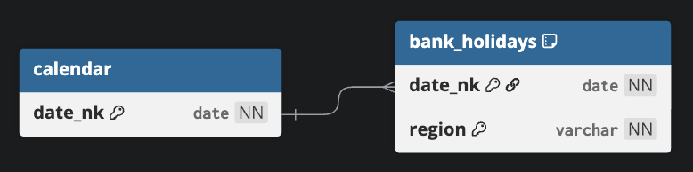

<span align="center">

[](https://www.python.org/downloads/)
[](https://github.com/astral-sh/uv)
[](https://github.com/billwallis/dbt-calendar/actions/workflows/tests.yaml)

[](https://results.pre-commit.ci/latest/github/billwallis/dbt-calendar/main)
[](https://shields.io/badges/git-hub-last-commit)

</span>

---

# dbt Calendar

A calendar data model for dbt projects.

This is similar to [godatadriven/dbt-date](https://github.com/godatadriven/dbt-date) (previously [calogica/dbt-date](https://github.com/calogica/dbt-date)), except the date attributes are primarily exposed as database objects rather than macros.

## Models

This package exposes the following models:

<div align="center">
  <a href="https://dbdiagram.io/home">
    
  </a>
</div>

<details>
<summary>Expand for corresponding <a href="https://dbml.dbdiagram.io/home">DBML</a></summary>

```dbml
Table calendar {
  date_nk date [not null, primary key]
}

Table bank_holidays {
  date_nk date [not null, ref: > calendar.date_nk]
  region varchar [not null]

  indexes {
    (date_nk, region) [pk]
  }
}
```

</details>

## Contributing

Install [uv](https://docs.astral.sh/uv/getting-started/installation/) and then install the dependencies:

```bash
uvx --from poethepoet poe install
```
